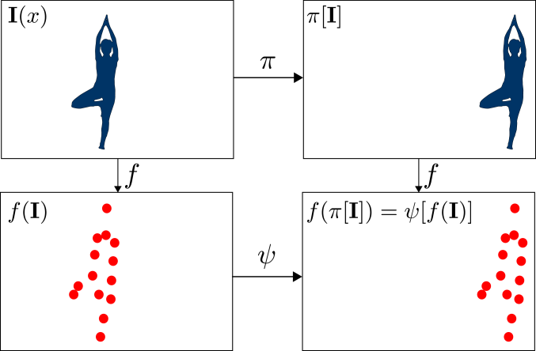
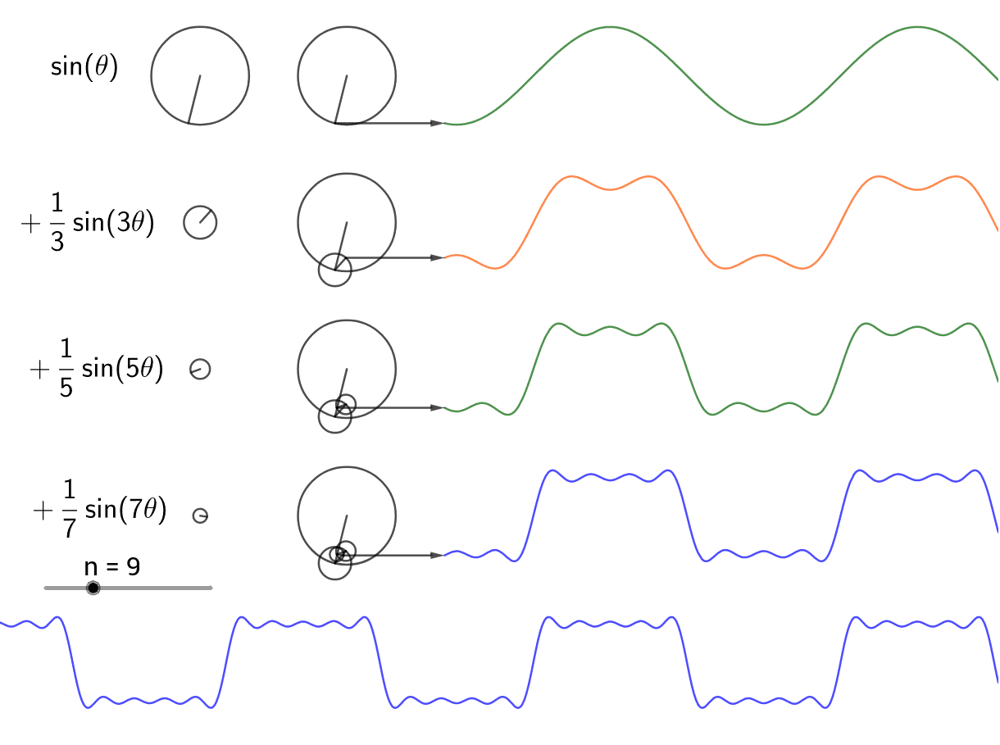
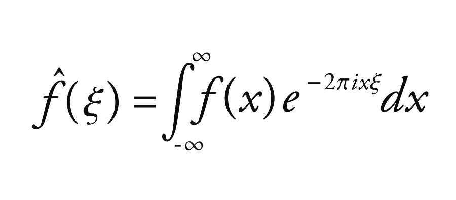
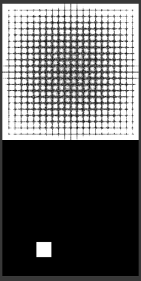
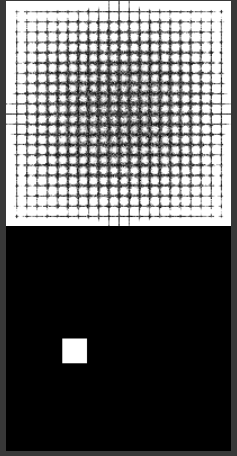

## Video

<iframe width="560" height="315" src="https://www.youtube.com/embed/YURJS52enMY" frameborder="0" allow="accelerometer; autoplay; encrypted-media; gyroscope; picture-in-picture" allowfullscreen></iframe>

## Project Summary

The goal of our project, Scout, is to enable the user to send commands via webcam to their sidekick, Scout, to be executed. The advantage of having this feature is that while the user is busy performing a task at hand, the Scout could be given orders to complete other duties in parallel. For example, if you were battling an enemy, but were also in need of food, you can instruct Scout to attack a nearby cow to retrieve meat. The greatest benefit from using Scout is that rather than taking more time to type out a command in the chat window, you just simply need to hold up a hand signal. This may not seem like a big deal, but in the time of combat, this extra time could save the agent’s life. Therefore, with the aid of Scout fulfilling the bare necessities, the agent will be able to focus on more complex missions. 

We built and trained a neural network model to learn how to classify 5 different hand signals. The commands implemented into our algorithm include 1 finger up, 2 fingers up, thumbs up, palm out, and fist out. In our status report, we were able to successfully read the command from the webcam and execute the respective action in MineCraft. The tasks were fairly simple such as moving forward 1 block, attacking, and turning. However, these motions are very trivial and provide no benefit to the agent. Therefore, in our final submission, we modified the actions to be more useful, including attacking a nearby animal, going to a designated spot, and following the agent. 

Without an accurate classification algorithm, the Scout would not provide any more assistance than a wild, untamed wolf. Hence, the majority of our project revolves around the precision of our hand gesture model so that the Scout can properly assist the user. 

The commands are saved in a command queue and will not be executed until the user holds up a fist. This way, the user can send a chain of commands for the Scout to perform and avoid the tediousness of gesturing one hand signal at a time. Using this structure, the user is able to be more efficient and can rely on Scout to carry out multiple simple, yet helpful, tasks. 

## Approaches

The Computer Vision pipeline of this project works as follows: a webcam points at a wall, and a user puts their hand in the frame and signals a gesture that they would like to carry out. Each frame of the video is processed through a model to generate the highest probability gesture, and returns the gesture’s value. The values are {0 : No Gesture, 1 : one finger up, 2 : two fingers up, 3 : thumbs up, 4 : palm out (“stop” gesture), 5 : fist up}.

The image goes through preprocessing, which greatly reduces the complexity of the data and makes it easier to map irrelevant features of an image into the same output. For example, everybody has a different skin tone; since we only care about the shape of the user’s hand, this feature is insignificant towards our model’s calculations. 
The image is downsampled by a scale of 5 in both the X and Y dimensions, decreasing its dimensionality by a factor of 25. This enables us to preserve the most crucial features of the image while also exponentially improving the learning curve of the model (specifically, scale2 since it’s a 2D image). 

The image is then normalized across the RGB axis, so that an image of HxWx3 becomes a grayscale image of HxWx1. This is done by computing the vector euclidean norm and dividing by the maximum vector norm ( ( 3 * 2552 )0.5). This means that a 3 channel pixel with RGB values (255, 255, 255) gets mapped to the grayscale value 1, while a pixel of RGB values (0, 0, 0) gets mapped to 0.
Next, we take a Gaussian kernel (a kernel with weights following a gaussian distribution according to their distances from the center of the matrix) and cross correlate it with the image. This acts as a low pass filter and removes random visual spikes such as random black and white spots, and makes the following step more effective.
Fourth, we take a Sobel kernel (a matrix with a positive value in the middle and negative values on the outsides and normalized to norm 1) and cross correlate it with the image. This is useful for falling edge detection, where a surface goes from bright to dark. The negative kernel is also applied to detect rising edges ranging from dark to light. After a bit of thresholding, we now have a map of edge detections that look like this:

Fifth, we take the mean and standard deviations of the activations in both the x and y directions. We center the image according to the mean and zero everything past 1.5 standard deviations from the mean. This gets rid of random extraneous things on the edge of the frame, like pets walking in and out of frame, lamp posts, etc. 
This condensed image then runs through a neural network. The details of the neural network is explained in the following paragraphs. 
The input will be a condensed mapping of the image, and the output will be a vector from [0, 5] (inclusive) indicating the natural log (for computational shortcuts & accuracy) of the confidence values that this gesture is of that class. For instance, a vector after exponentiating it to e might look like [.95, .01, .01, .01, .01, .01]. Now, we have taken care of color variance in the image after running it through edge detection and binarizing the image. The images are almost centered, but there is still a considerable amount of jitter. What we are looking for is called translation invariance, the property stating that an image can be translated in any direction and still produce identical output. There is another property called equivariance, which means that performing some function on a signal (translation in this case), produces a signal where we can extract the function used along with the actual signal. Therefore, translating a signal and then passing it through an equivariant function would allow us to determine the magnitude of the translation. What we want is invariance, but we can use equivariance to help achieve this.
In order to achieve invariance, we could use brute force to train the model on every possible position of images. However, this is inefficient in terms of storage, time that it takes to generate the data & train the network, and in learning capacity since parameters will be wasted on learning something we can simply just calculate. Constraints grow exponentially in brute force, as opposed to linearly if we enforce invariance. 

Matrix correlations, the operation behind what is known as a Convolutional layer in Neural networks, are translation equivariant. Essentially, if we shift an image to one side, then the output is the same as the original, but just shifted over a bit. Here’s an example:

Convolutional layers are also extremely parameter efficient and able to represent complex spatial relationships when stacked, which will come in handy in a bit.

If we have some signal, we can decompose it into a sum of sinusoids of the form A*sin(2*pi*f*t + b), each with their own amplitude (A), phase shift (b), and frequency (f). Here’s an example:

{:height="50%" width="50%"}

We can recover these phase shifts and frequencies through a process called the Fourier Transform. Here is the formula for it:

We see that the Fourier transform is essentially a dot product between our function f(x) and the exponential term on the left (which simplifies to a sum of sinusoids). This means that it is a differentiable function between the output and the input, which is a key requirement for neural network layers. If we take the euclidean norm of the fourier coefficients for a point in the signal, we can recover the amplitude of the signal in that frequency bin. What this means is that, no matter what the phase shift of some sinusoid function is, if it is added to some signal, then we can recover the amplitude & frequency. This means that this is translation invariant relative to the output. Here is an example:

FFT amplitude:frequency output on top, image on bottom

However, it can’t really do anything about gesture recognition by itself. If we take translation equivariant operations, chain them, and pass them to a translation invariant operation, we can still end up with a translation invariant function! This is because a phase shift in a translation equivariant function leads to a phase shift in the output, which we’ve shown translation invariant functions don’t care about! This means that we can first pass our image through a series of Convolutional layers, which are expressive but not invariant, to recover a map of important features in the image, and then pass this map through a Fourier transform (and extract the amplitude representation), which is invariant but not expressive, to have a complex representation of the map that doesn’t care where the signal is. This amplitude over frequency representation can then be passed to a set of layers called dense layers that are very expressive, but not equivariant nor invariant, to perform the final computations. The network was built in PyTorch, and the code is as follows:

    class HandGestureClassifier2(nn.Module):
        def __init__(self):
            super().__init__()
            self.conv_pipeline = nn.Sequential(
                nn.Conv2d(in_channels= 1, out_channels= 16, kernel_size= 3, padding= 1), # 1 * 96 * 128 -> 16 * 96 * 128
                nn.LeakyReLU(),
                nn.Conv2d(in_channels= 16, out_channels= 32, kernel_size= 5, padding= 2), # 16 * 96 * 128 -> 32 * 96 * 128
                nn.LeakyReLU(),
                nn.Conv2d(in_channels= 32, out_channels= 32, kernel_size= 5, padding= 2), # 32 * 96 * 128 -> 32 * 96 * 128
                nn.LeakyReLU(),
                nn.MaxPool2d(kernel_size= 2, stride= 2),
                nn.Conv2d(in_channels= 32, out_channels= 8, kernel_size= 3, padding= 1), # 32 * 48 * 64 -> 8 * 48 * 64
                nn.LeakyReLU(),
                nn.Conv2d(in_channels= 8, out_channels= 8, kernel_size= 3, padding= 1), # 8 * 48 * 64 -> 8 * 48 * 64
                nn.LeakyReLU(),
                nn.Conv2d(in_channels= 8, out_channels= 1, kernel_size= 1), # 8 * 48 * 64 -> 1 * 48 * 64
                nn.LeakyReLU()
            )

            self.linear_pipeline = nn.Sequential(
                nn.Linear(in_features= 48 * 33, out_features= 64),
                nn.LeakyReLU(),
                nn.Linear(in_features= 64, out_features= 48),
                nn.LeakyReLU(),
                nn.Linear(in_features= 48, out_features= 48),
                nn.LeakyReLU(),
                nn.Linear(in_features= 48, out_features= 6),
                nn.LogSoftmax()
            )
        
        def forward(self, X):
            X = self.conv_pipeline(X)

            # Image-wise 2d FFT, positive frequencies only since images are real signals
            # Transform to Amps : Freq
            X = torch_rfftn(X, dim= (2, 3) )
            X = torch.abs(X)

            X = X.view(-1, 48 * 33)
            
            X = self.linear_pipeline(X)
            return X

The network was trained on images generated by Saswat and tested on images from Google that were held up on a phone. Because of this compressed representation, we only had to train this for 5 epochs with batch sizes of 64 and a dataset size of 1,000 images to produce .001 training & validation error (average Negative Log Likelihood Binary Cross Entropy). For those not used to computer vision applications, that is an extremely low amount of training time & data. This compressed & invariant representation, however, allows us to pack the most information into a small amount of space, which allows us to speed up training by a lot.
For hold out data, we used data from Google images, and tested it at different scales, lighting, colors, and angles. We tested 4613 images in total, and the entire model had a testing error of .001 average NLLBCE.

The baseline model was simply a random guesser; it just picked random numbers and confidences depending on the initial weight distribution. It was not useful for anything. The model at that checkpoint was not translation invariant, and it had far more dense layers, which are very expensive in terms of numbers of parameters. As a result, it had worse performance despite having significantly more parameters. The current iteration cuts the amount of parameters by 1/20th and is 6 times more accurate, due to a heavier reliance on convolutional layers, which are very cheap on parameters.

The wolf AI was implemented through creating a Minecraft mod that created a wolf that would utilize Minecraft’s AI upon detecting chat commands from the client. We went this route as implementing several of the commands through Malmo wasn’t the focus of the machine learning component of the project and leaning into the more robust Minecraft AI provided a more reactive way of showcasing the capabilities of the project in real world applications. The main challenge of this approach was grappling with how AI is abstracted in Minecraft and the event driven model of mods.

## Evaluation

As stated before, the performance of the Scout is highly dependent on the accuracy of the hand gesture classification model. Therefore, we do not want to add a command to the command queue unless it achieves a confidence level of 98% or higher to avoid Scout from doing anything we do not intend for it to do. After implementing optimizations and multiple test runs, we were able to achieve a training loss of 0.001 NLLBCE, a validation loss of 0.001 NLLBCE, and a testing loss of 0.001 NLLBCE. 

In the Approaches section, we mentioned the improvements we integrated into the model to further enhance its performance. We are able to grayscale the images because the colors of the pixels are irrelevant to the classification of the proper hand gesture. With the use of the Gaussian kernels, we are able to remove insignificant details and noise. The Sobel kernel emphasizes the edges to accurately capture the hand signal. As a result, the translated input from the webcam is invariant to skin color, lighting level, lighting color, translation, camera artifacts, and aliasing. All these factors are what allowed us to minimize our model’s loss and in turn, increase our model’s accuracy. 

## References

AI/ML libraries:
- Torch
- Opencv
- Numpy 

Source code:
- Multi-agent source code provided by TA
- Code from Assignment #2 

Code Documentation:
- [Malmo Minecraft XML Documentation](https://microsoft.github.io/malmo/0.21.0/Schemas/MissionHandlers.html#top)
- [Forge Mod API Documentation](https://skmedix.github.io/ForgeJavaDocs/javadoc/forge/1.9.4-12.17.0.2051/overview-summary.html)

Image Sources:
- [Fourier Transform](https://images.fineartamerica.com/images-medium-large-5/fourier-transform-science-photo-library.jpg)
- [Image Shift](https://miro.medium.com/max/1354/0*nV_o47J-bsA3ev5O.png)
