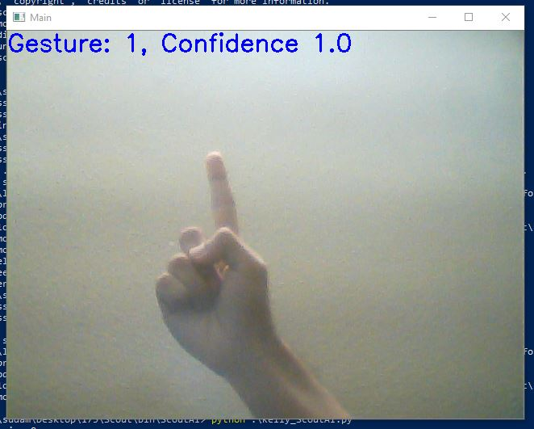
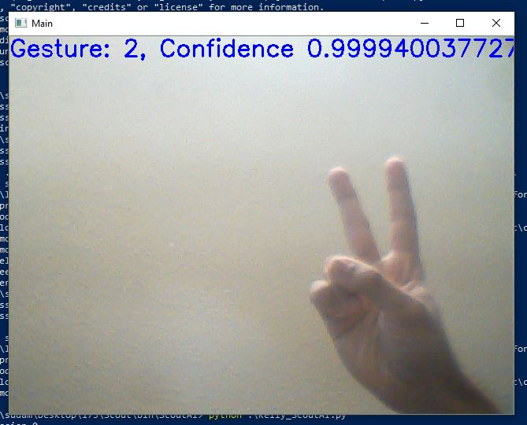

[Source Code](https://github.com/eriejar/Scout)

Reports:

- [Proposal](proposal.md)
- [Status](status.html)
- [Final](final.html)

Scout AI aims to create a autonomous AI inside Minecraft that will execute actions based on hand gestures from the user. This will utilize pytorch's machine learning in order to classify actions and also will require behavior for Scout AI to be developed as native AI behaviors are not available from Minecraft are not available to be utilized for player characters.

Actions to be developed include moving to where the player is looking at, retrieving items, attacking enemies and other simple actions.

Hand Detection Showcase

Trainer Agent and Scout Agent in the same server

[quickref]: https://github.com/mundimark/quickrefs/blob/master/HTML.md
