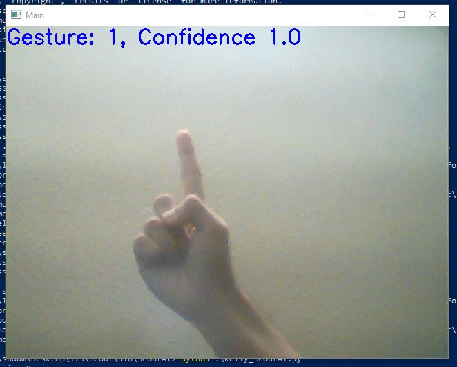
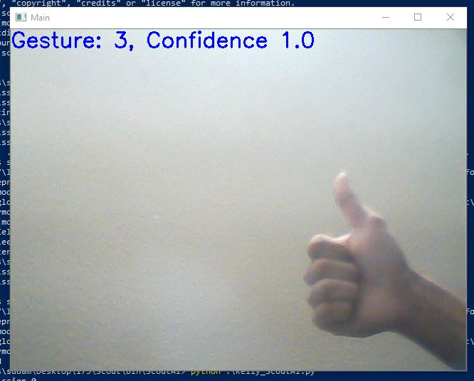

## Video Summary:
[Video Summary Link](https://youtu.be/5tFRGf7K6w0)

## Project Summary:
The purpose of this project is to create a Scout that can accurately receive and execute commands from the user through webcam input. Commands will be expressed through hand signals (i.e. thumbs up, one finger, two fingers) and depending on the command, the Scout will perform the respective action. The desirable actions are as follows:

Thumbs up: follow the agent controlled by the user
Thumbs down: Quit mission
One finger: Attack nearby animal and retrieve food
Two fingers: Sentry mode (protect the agent)

## Approach:
The first thing that we need is the input from the webcam. We utilize torch and opencv to capture live input from the user’s camera and a neural network to classify the hand gesture (a.k.a command for the Scout to execute). We used a convolutional neural network with the LeakyRelu activation function and 2 dropout layers. 

While the mission is still taking place, the agent continuously listens for commands. The default value is 0, which means that no gesture is being presented. If a gesture is present, then the command is valid and is sent to the Scout AI. Furthermore, based on the gesture classification, the Scout will be fed a command to execute. Once the command has been completed, the Scout will then actively listen for another command. The mission is complete once the user gives a “thumbs down” gesture, indicating that the user no longer has any commands. 

Expansion of the ScoutAI will require the integration of MCCreator in order to include default Mob AI instead of relying on developer built AI using the limited resources from Malmo’s API. This will allow us to quickly add complex behavior that we can then train ScoutAI to manage compound combinations of such behavior (timing of command switches) if the scope of the project increases to include reinforcement learning.

## Evaluation:
One performance evaluation for our project is the accuracy of our hand gesture classifier. For every gesture that we train the model with, we want it to achieve an accuracy of 98% or higher so that the Scout performs the correct command. As of right now, we have three working commands:
1 finger up (1): turn 1 
2 fingers up (2): attack 1
Thumbs up (3): move 1

  

## Remaining Goals and Challenges:
Currently, we have a functional hand gesture classifier and multi-agent environment. The Scout is capable of performing simple commands such as moving forward, turning, and jumping. The gestures that we have classified are also very basic including a thumbs up, thumbs down, one finger up, and two fingers up. Although these gestures and commands work, they are not very beneficial to the user in the game. More specifically, having a Scout that just moves, turns, and jumps will not aid the user at all. 

For our final product, we are aiming to implement more complex hand signals to better represent the respective action to execute. Additionally, we would like the Scout to perform more valuable actions such as retrieving food, attacking an enemy to protect the user, etc. Since these gestures and commands will be more complicated, we expect most of the future challenges to be in regards to high confidence levels and the execution of the Scout’s actions. Since we only coded three hand gestures so far, with the introduction of more complex ones may lower the confidence level of the others. However, with sufficient training, we expect the model to perform as well as it does currently. Additionally, the code for the commands we would like to implement requires a lot more computation and input from the Scout’s environment. We will tackle this challenge by slowly working our way up to the end goal. In other words, we will split each command into smaller checkpoints to build up to the more complicated action. 

## Resources Used:
AI/ML libraries:
Torch
Opencv
Numpy 

Source code:
Multi-agent source code provided by TA
Code from Assignment #2 

Code Documentation:
[Malmo Minecraft XML Documentation](https://microsoft.github.io/malmo/0.21.0/Schemas/MissionHandlers.html#top)

